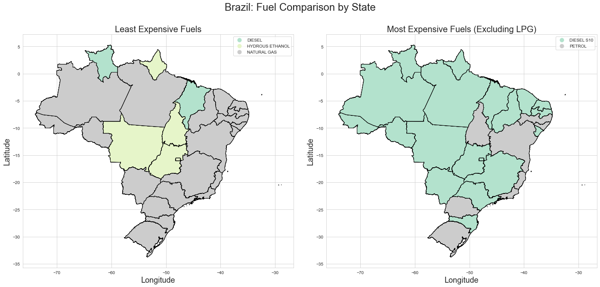

[![Contributors][contributors-shield]][contributors-url]
[![Forks][forks-shield]][forks-url]
[![Stargazers][stars-shield]][stars-url]
[![Issues][issues-shield]][issues-url]
[![MIT License][license-shield]][license-url]
[![LinkedIn][linkedin-shield]][linkedin-url]

#  Survey of fuel prices in Brazil: Geospatial Analysis
This project includes EDA and geospatial analyses in the form of choropleth maps to visualize fuel price data from the [*Agência Nacional do Petróleo, Gás Natural e Biocombustíveis*](http://www.anp.gov.br/) in Brazil. The dataset was made available through [Kaggle](https://www.kaggle.com/matheusfreitag/gas-prices-in-brazil) and incorporates [public geospatial data](ftp://geoftp.ibge.gov.br/organizacao_do_territorio/malhas_territoriais/malhas_municipais/municipio_2016/Brasil/BR/) available through public ftp from the Brazilian government.

#### -- Project Status: [Completed]

## Project Objective
The purpose of the project is to perform basic exploratory data analysis and to answer three questions regarding the prices of fuel products in Brazil using geospatial analysis:
* How did the price change for the different regions of Brazil?
* Within a region, which states increased their prices the most?
* Which states are the cheapest (or most expensive) for different types of fuels?

These questions are addressed using choropleth map visualizations in the notebook *0.3-geospatial-analysis.ipynb*.

## Description
The fuel price data comes from the *[Agência Nacional do Petróleo, Gás Natural e Biocombustíveis](http://www.anp.gov.br/precos-e-defesa-da-concorrencia/precos/levantamento-de-precos/serie-historica-do-levantamento-de-precos-e-de-margens-de-comercializacao-de-combustiveis)* (ANP in Portuguese), which releases weekly price reports of gas/petrol, diesel and other fuels used in transportation across the country. It includes the mean value per liter, number of gas stations analyzed and other information grouped by region and state. The analysis is enriched by joining the price data with geospatial data from the Brazilian government.

## Technologies
* Python, Anaconda
* Pandas, Matplotlib, Seaborn, Geopandas, Jupyter Notebook

## Data Sources
Fuel Prices:
* Aggregated dataset: https://www.kaggle.com/matheusfreitag/gas-prices-in-brazil
* Original data source: http://www.anp.gov.br/precos-e-defesa-da-concorrencia/precos/levantamento-de-precos/serie-historica-do-levantamento-de-precos-e-de-margens-de-comercializacao-de-combustiveis 

Shapefiles:
* [ftp://geoftp.ibge.gov.br/organizacao_do_territorio/malhas_territoriais/malhas_municipais/municipio_2016/Brasil/BR/](ftp://geoftp.ibge.gov.br/organizacao_do_territorio/malhas_territoriais/malhas_municipais/municipio_2016/Brasil/BR/)

## Featured Notebooks
* `0.1-import-clean-eda.ipynb` --> [view notebook](https://github.com/abk7777/brazil-fuel-price/blob/master/notebooks/0.1-import-clean-eda.ipynb)
* `0.2-geospatial-analysis.ipynb` --> [view notebook](https://github.com/abk7777/brazil-fuel-price/blob/master/notebooks/0.2-geospatial-analysis.ipynb)
* An older version of this project was submitted as a [Kaggle kernel](https://www.kaggle.com/abk7777/geospatial-analysis-of-gas-prices-in-brazil).

## Getting Started
1. Clone repo
2. Run `conda env create -f environment.yml` to create the environment (requires Anaconda)
3. Run `conda activate brazil_fuel_price_env` to activate the environment
4. Run each notebook:
   - `0.1-import-clean-eda.ipynb`
   - `0.2-geospatial-analysis.ipynb`
5. Figures are saved to the `figures` directory

## Authors

* **Gregory Lindsey** - [abk7777](https://github.com/abk7777)

## License

This project is licensed under the MIT License.

[contributors-shield]: https://img.shields.io/github/contributors/abk7777/brazil-fuel-price-analysis.svg?style=flat-square
[contributors-url]: https://github.com/abk7777/brazil-fuel-price-analysis/graphs/contributors
[forks-shield]: https://img.shields.io/github/forks/abk7777/brazil-fuel-price-analysis.svg?style=flat-square
[forks-url]: https://github.com/abk7777/brazil-fuel-price-analysis/network/members
[stars-shield]: https://img.shields.io/github/stars/abk7777/brazil-fuel-price-analysis.svg?style=flat-square
[stars-url]: https://github.com/abk7777/brazil-fuel-price-analysis/stargazers
[issues-shield]: https://img.shields.io/github/issues/abk7777/brazil-fuel-price-analysis.svg?style=flat-square
[issues-url]: https://github.com/abk7777/brazil-fuel-price-analysis/issues
[license-shield]: https://img.shields.io/github/license/abk7777/brazil-fuel-price-analysis.svg?style=flat-square
[license-url]: https://github.com/abk7777/brazil-fuel-price-analysis/blob/master/LICENSE
[linkedin-shield]: https://img.shields.io/badge/-LinkedIn-black.svg?style=flat-square&logo=linkedin&colorB=555
[linkedin-url]: https://linkedin.com/in/gregory-lindsey/